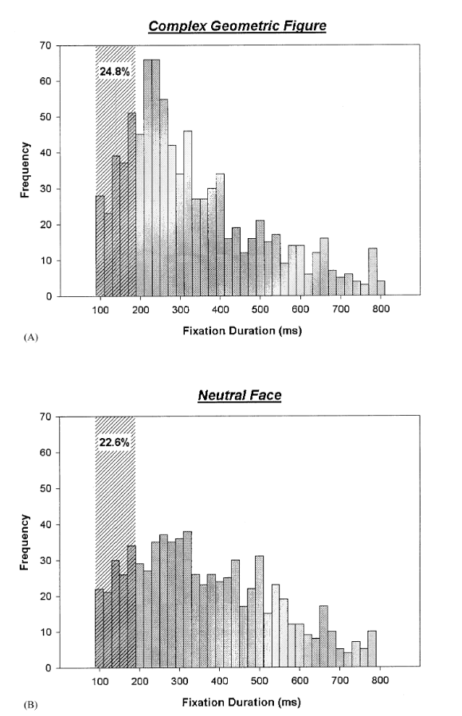

```{r setup, include=FALSE}
knitr::opts_chunk$set(echo = TRUE)
library(tidyverse)
#library(ggpubr)
```

*Última atualização: `r format(Sys.Date(), "%d/%m/%Y")`*

# A fixação como um evento

A fixação pode ser entendida como um **momento no qual o olhar se fixa, por um certo perído de tempo, em um ponto (x, y)**. Por ter inicio e fim é considerada um evento, porém como determinar o momento exato da fixação em um ponto em relação ao livre movimento ocular e/ou movimento sacádico?

Há uma série de questões que impedem uma fixação "plena"do olhar. A primeira delas correspondem ao aparelho oculomotor, que naturalmente tem um *drift* de 1 grau mesmo quando está performando uma fixação. Em segundo lugar, sempre irá existir um ruído de medição de equipamento, gerando variabilidade da medição ao longo do tempo. Este ruído pode ser proveniente do algoritmo de processamento de imagem da câmera, de movimentações da cabeça ou de etapas de pré-processamento em baixo nível. Portanto, registrar um ponto que mantenha uma coordenada x,y constante ao longo por um determinado período de tempo é bastante improvável.

# Detecção de fixações

Em ambos os cenários descritos acima, quando performamos uma fixação, podemos dizer que dentro de um intervalo de confiança estaremos atingindo um certo ponto x,y. Afirmando isso, temos não um ponto x,y mas sim um **conjunto de potenciais pontos que estando próximos podem ser considerados como uma fixação em um ponto médio x,y**.

Esta ideia é empregada nos **algoritmos de detecção por limiar de dispersão (I-DT).** Estes algoritmos estipulam que adotemos um limiar aceitável para que um ponto se distancia do conjunto de pontos, geralmente de 2 graus. Assim, **todos os pontos que manténham uma distância de no máximo 2 graus entre si podem ser considerados fixações.**

Porém, qual seria o menor conjunto de pontos possível para que verifiquemos suas distâncias? Outra característica das fixações é que, devido ao tempo de resposta do aparelho oculomotor e devido a natureza da fixação, **há um valor mínimo de duração esperado para o evento de fixação.** Este valor costuma ser maior que 50 ms e menor que 800 ms. No geral, a maior distribuição de fixações é encontrada entre 200 ms e 400 ms.



Com este dado, podemos definir uma janela de pontos mínimos para se considerar uma fixação. Fazemos isso como função de nossa amostragem.

$$
\text{n_window} = \text{frame rate [points/s]} \cdot \text{temporal threshold [s]}
$$

É importante dizer que ambas as grandezas devem ser iguais, pois, se temos 60 quadros por segundo e um limiar de 100ms, devemos converter este limiar para segundos (0,1 segundo).

## Algoritmo I-DT

```{r}
i_dt <- function (xy_points, 
                  dispersion_threshold, temporal_threshold, sample_rate){
  
  # Define o tamanho da amostra
  n = nrow(xy_points)
  
  # Define a janela minima, encontrando a quantidade de pontos para aquele limiar      temporal
  n_min_window = temporal_threshold/1000 * sample_rate
  n_window = n_min_window # janela inicial corresponde a janela minima.
  
  # Guarda as fixacoes
  fixations <- numeric()
  pX <- numeric()
  pY <- numeric()
  #duration <- numeric()
  
  # Enquanto o próximo ponto for menor ou igual ao total de amostras
  while (nrow(xy_points) > n_window){
    window_pts = xy_points[1:n_window, ]
    
    # Calcula a dispersao da janela
    d_x = max(window_pts$pXraw) - min(window_pts$pXraw)
    d_y = max(window_pts$pYraw) - min(window_pts$pYraw)
    d_total = d_x + d_y
    
    if (d_total < dispersion_threshold) {
      while((d_total < dispersion_threshold) && (n_window < nrow(xy_points)) ){
        n_window = n_window + 1
        window_pts = xy_points[1:n_window, ]
        
        # Calcula a dispersao da janela
        d_x = max(window_pts$pXraw) - min(window_pts$pXraw)
        d_y = max(window_pts$pYraw) - min(window_pts$pYraw)
        d_total = d_x + d_y
      }
      
      fixations <- c(fixations, round(n_window/sample_rate, 4))
      pX <- c(pX, round(mean(window_pts$pXraw), 4))
      pY <- c(pY, round(mean(window_pts$pYraw), 4))
      
      xy_points <- xy_points[-(1:n_window),]
      n_window = n_min_window
    } else{
      fixations <- c(fixations, 0)
      pX <- c(pX, round(mean(window_pts$pXraw), 4))
      pY <- c(pY, round(mean(window_pts$pYraw), 4))
      xy_points <- xy_points[-1,]
    }
    
    print(nrow(xy_points))
  }
  
  return(tibble(fixations, pX, pY))
}
```

# Recalculo das fixações

No conjunto de dados original já há o registro por meio de cálculo de captura das fixações pelo software. Iremos recalcular, com base nos pontos x,y brutos de movimentação ocular, estas piscadas com diferentes limiares.

```{r}
# Carrega lista de arquivos
filenames <- list.files(here::here("data/project_data_source/working/cleaned/controle"), full.names = TRUE)
# Ajeita nomes
names(filenames) <- sub(".tsv", "", sub("^.*/", "", filenames))
# Cria lista de participantes
participantes <- lapply(filenames, read_tsv)
```

```{r}

fixations_participante = list()

fixations_participante

for (participante in participantes){
  fixations_participante <- append(fixations_participante, i_dt(participante[,c("pXraw", "pYraw")], 0.1746, 100, 60))
}

```
