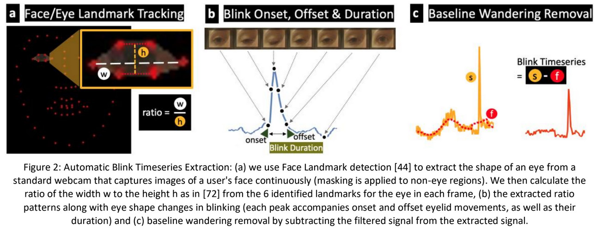

```{r setup, include=FALSE}
knitr::opts_chunk$set(echo = TRUE)
library(tidyverse)
library(plotly)

# Carrega lista de arquivos
filenames <- list.files(here::here("data/project_data_source/working/cleaned/controle"), full.names = TRUE)
# Ajeita nomes
names(filenames) <- sub(".tsv", "", sub("^.*/", "", filenames))
# Cria lista de participantes
participantes <- lapply(filenames, read_tsv)
```

*Última atualização: `r format(Sys.Date(), "%d/%m/%Y")`*

# O fenômeno da piscada

A piscada pode ser considerada como um **erro de registro** em diversas variáveis, como na movimentação ocular, fixação e diâmetro pupilar. Este erro tem um formato característico, semelhante a um pico destoante da mediana do sinal no qual há falta de dados. Somente a variável referente ao aspecto pupilar não registraria a piscada como um erro, uma vez que o fenômeno da piscada implica necessáriamente numa mudança gradativa da razão do aspecto pupilar (aspect ratio).

Essa mudança corresponde a mudança da proporção (aspect ratio) da identificação da pupila como circulo perfeito. Durante uma piscada, as pálpebras ocludem a pupila e portanto a pupila deixa de estar representada como um círculo, passando a um formato elíptico, chegando a nenhuma identificação (oclusão total) e voltando gradativamente ao formato circular novamente. Esse evento é descrito nas páginas 54 e 58 do manual do Eye-Tracker ViewPoint, onde diz respectivamente:

> *Blinks can be detected by monitoring the pupil aspect ratio. This is a dimensionless value, where 1.0 indicates a perfect circle.*

> ***10.2.4 Blinks***
>
> *As the eye lid comes down during a blink, the elliptical fit to the pupil becomes increasingly flat before it disappears. This characteristic change in the aspect ratio of elliptical fit to the pupil can be used to detect blinks. **A blink is classified as the pupil aspect ratio crossing below the threshold.***

Este fenômeno também é explorado por @cho2021 no qual é proposto a identificação de piscadas através da análise da série temporal do aspecto pupilar.



Neste artigo, a abordagem utilizada não estipula um limiar (threshold) para determinar quais pontos são piscadas e quais não são, buscando uma análise de frequência de toda série temporal. A análise é realizada filtrando o sinal (média móvel de 1 segundo e filtro passa-banda na frequência de 0.033Hz a 0.4167Hz). Estes valores foram escolhidos visando uma frequência de piscada de 2 a 25 por minuto. Posteriormente, foi criado um espectrograma calculando a potência de Lomb-Scargle e empregado um algortimo de aprendizado de máquina a fim de classificar os períodos de maior e menor frequência de piscadas.

## Hipóteses

-   Aspecto pupilar - `PupilAspect` - deve estar igual ou próximo a 1 durante momentos de "não piscada". Portanto, **boa parte da distribuição dos dados deve ter mediana próximo de 1.**

-   Um evento de piscada consiste na mudança do Aspecto pupilar de 1 para 0. Portanto, devem exister pontos destoantes, próximos a zero, com uma certa frequência.

-   Essa mudança é gradativa, sendo possível notar o *onset* e o *offset* da piscada, tal como um vale. Logo, nem todos os pontos destoantes são piscadas, mas sim "parte" da piscada.

-   Demais variáveis devem apresentar perturbações, desviando bruscamente o registro da mediana do sinal --\> Registros fora de mediana poderiam ser considerados piscadas ou ruídos (outliers).

# Visualização dos dados

## PupilAspect x TotalTime

Plotagem da série temporal da variável `PupilAspect` de todos os participantes do grupo controle ao longo do tempo percorrido. Foi considerado um gráfico de linha, uma vez que o dado é contínuo, sendo aplicado uma função de suavização de tendência. A qualidade do dado é classificada em uma escala de 0 a 5, sendo quanto menor o valor melhor.

```{r Plots PupilAspect x TotalTime todos participantes, echo=TRUE, message=FALSE, warning=FALSE}
pupAspXtime_all = vector(mode="list")

i = 1
for (participante in participantes) {
  pupAspXtime_all[[i]] <- ggplot(data = participante) +
    geom_path(mapping = aes(x = TotalTime, y = PupilAspect, colour = Quality)) +
    geom_smooth(mapping = aes(x = TotalTime, y = PupilAspect)) +
    ggtitle(names(participantes[i]))
  
  i <- i+1
}

pupAspXtime_all

```

## Distribuição do PupilAspect

Plotagem do histograma da variável `PupilAspect` de todos os participantes. Marcação da **mediana** em azul, **Q1** e **Q3** em amarelo e **limite máximo** e **mínimo** do **intervalo interquartil** em vermelho.

O limite máximo e mínimo equivalem a 1,5 vezes o intervalo interquartil (IQR).

```{r Plotagem histogramas, echo=TRUE}
pupAspHist = vector(mode = "list")  
  
i = 1
for (participante in participantes) {
  pupAspHist[[i]] <- ggplot(data = participante) +
    geom_histogram(mapping = aes(PupilAspect), binwidth = 0.005) +
    geom_vline(xintercept = median(participante$PupilAspect), linetype="dotted", color = "blue", size = 1) +
    geom_vline(xintercept = quantile(participante$PupilAspect, 1/4), linetype="dotted", color = "yellow", size = 1) +
    geom_vline(xintercept = quantile(participante$PupilAspect, 3/4), linetype="dotted", color = "yellow", size = 1) +
    geom_vline(xintercept = quantile(participante$PupilAspect, 1/4) - 1.5*IQR(participante$PupilAspect), linetype="dotted", color = "red", size = 1) +
    geom_vline(xintercept = quantile(participante$PupilAspect, 3/4) + 1.5*IQR(participante$PupilAspect), linetype="dotted", color = "red", size = 1) +
    ggtitle(names(participantes[i]))
  i <- i+1
}
 
pupAspHist
```

# Detecção de piscada

## 1. Tentativa de Detecção por Intervalo Interquartil

**Objetivo:** Classificar como "piscada" todos os pontos que estão além dos limites do intervalo interquartil.

Para esta tentativa serão considerados somente os limites inferiores, uma vez que a natureza do evento reflete somente a diminuição do `PupilAspect` para valores inferiores a 1 e, por consequência, inferiores a massa da distribuição. A massa da distribuição reflete qual aspecto pupilar o participante apresenta na maior parte do tempo.

### Teste em participante "ideal"

Foi escolhido o participante **2179**, por ter um baixo intervalo interquartil e distribuição relativamente simétrica.

```{r Separacao de pontos por limite inferior interquartil, echo=TRUE}
limite_inferior = quantile(participantes$`2179`$PupilAspect, 1/4) - 1.5*IQR(participantes$`2179`$PupilAspect)

out_points = participantes$`2179`$PupilAspect < limite_inferior

paste("Total de valor abaixo do limite inferior: ", 
      sum(out_points == TRUE))


pupAspectXTime_out_graph <- ggplot(data = participantes$`2179`) +
    geom_path(mapping = aes(x = TotalTime, y = PupilAspect, colour = out_points)) +
    scale_color_manual(values = c("black", "red")) +
    geom_hline(yintercept = limite_inferior, linetype="dotted")+
    ggtitle("2179")
    
pupAspectXTime_out_graph
```

Como resultado, **831 pontos foram classificados além do limite inferior** sendo ou não potenciais piscadas. Considerando uma amostra de 450 segundos (7:30 minutos) onde todos estes pontos são piscadas, **teríamos uma frequência de aproximadamente 110 piscadas por minuto**. A critério de comparação, de acordo com a literatura, um indivíduo sem privação de sono apresenta de 9 a 13 piscadas por minuto, enquanto um individuo com privação de sono apresenta de 20 a 30 piscadas por minuto.

**Existem algumas questões a serem avaliadas:**

-   Nem todos os pontos destoantes são piscadas. Vários são pontos intermediários entre a oclusão total e a reabertura. Cabe entender como agregar esses pontos e contabilizá-los como uma piscada.

-   Há a possibilidade de que a mediana varie localmente e, portanto, varie o limiar de classificação. Para isso, podemos comparar recortes locais com o cálculo global de mediana e o cálculo local. Dependendo dos resultados, talvez adotar uma abordagem de classificação por mediana móvel possa ser uma opção.

#### Recorte de 1 minuto, utilizando cálculo global.

Recorte temporal de 1 minuto, utilizando o cálculo global da mediana e interquartil (para toda amostra)

```{r Recorte de 1 minuto}
pupAspectXTime_out_graph <- ggplot(data =
    participantes$`2179`[participantes$`2179`$TotalTime < 60, ]) +
    geom_path(
      mapping = aes(x = TotalTime, y = PupilAspect, colour = out_points[1:3556])) +
    scale_color_manual(values = c("black", "red")) +
    geom_hline(yintercept = limite_inferior, linetype="dotted")+
    ggtitle("2179")

paste("Total de valor abaixo do limite inferior: ", 
      sum(out_points[1:3556] == TRUE))
    
pupAspectXTime_out_graph
```

Como resultado, 182 pontos foram identificados abaixo do limite inferior. Caso todos estes pontos sejam de fato "piscadas" teremos 182 piscadas por minuto, bem distante do observado na literatura.

#### Recorte de 1 minuto, utilizando cálculo local

Neste teste, a mediana e os intervalos interquartis foram calculados considerando somente os dados do recorte local.

```{r Recorte de um minuto, calculo local}
participante_recorte = participantes$`2179`[participantes$`2179`$TotalTime < 60, ]

limite_inferior = quantile(participante_recorte$PupilAspect, 1/4) - 1.5*IQR(participante_recorte$PupilAspect)

out_points = participante_recorte$PupilAspect < limite_inferior

paste("Total de valor abaixo do limite inferior: ", 
      sum(out_points == TRUE))


pupAspectXTime_out_graph <- ggplot(data = participante_recorte) +
    geom_path(mapping = aes(x = TotalTime, y = PupilAspect, colour = out_points)) +
    scale_color_manual(values = c("black", "red")) +
    geom_hline(yintercept = limite_inferior, linetype="dotted")+
    ggtitle("2179")
    
pupAspectXTime_out_graph

```

Como resultado, foram identificados 160 pontos. Mesmo sendo um valor mais próximo da literatura, continua sendo bem distoante.

## Identificação de onduleta

```{r}
pupAspectXTime_out_graph <- ggplot(data =
    participantes$`2179`[participantes$`2179`$TotalTime < 2, ]) +
    geom_path(
      mapping = aes(x = TotalTime, y = PupilAspect, colour = out_points[1:119])) +
    scale_color_manual(values = c("black", "red")) +
    geom_hline(yintercept = limite_inferior, linetype="dotted")+
    ggtitle("2179")

paste("Total de valor abaixo do limite inferior: ", 
      sum(out_points[1:119] == TRUE))
    
pupAspectXTime_out_graph
```

# Tentativa de deteção por algoritmo de I-DT adaptado

**Objetivo:** Adaptar algoritmo de deteção de fixações por dispersão temporal em um algoritmo de deteção de piscadas.

Para essa tentativa serão realizadas as seguintes adaptações no algoritmo de I-DT prente em @salvucci2000

-   Será utilizado uma verificação de dispersão da mediana, sendo considerado como limiar 1,5\*IQR

-   A mediana será calculada a cada janela

-   Ao detectar pontos após 1,5\*IQR será executada uma estratégia de expansão de janela, igual ao algoritmo original.

-   Ao fim, a piscada será considerada no ponto médio da série temporal da janela, registrando sua duração.

## Algoritmo I-DT adaptado para detectar piscadas

```{r}
# Recebe um dataframe com PupilAspect e TotalTime, um limiar baseado no IQR, um limiar temporal e a taxa de amostragem

i_iqr_blink <- function (pa_points, 
                  iqr_threshold, temporal_threshold, sample_rate){
  
  # tamanho total da amostra
  n <- nrow(pa_points)
  
  # Define a janela minima, encontrando a quantidade de pontos para 
  # aquele limiar temporal
  n_min_window = temporal_threshold/1000 * sample_rate
  n_window = n_min_window # janela inicial corresponde a janela minima.
  
  # Guarda as piscadas
  blinks <- tibble(Blinks = numeric(), TotalTimeRef = numeric() )
  
  # Enquanto o próximo ponto for menor ou igual ao total de amostras
  while (nrow(pa_points) > n_window){
    window_pts = pa_points[1:n_window]
    
    # se o ponto for menor que o limiar iqr
    if (pa_points[1]$PupilAspect < iqr_threshold) {
      
      # enquanto o ponto for menor que o limiar iqr aumenta o tamanho da janela
      while((pa_points[1]$PupilAspect < iqr_threshold) && 
            (n_window < nrow(pa_points)) ){
        n_window = n_window + 1
        window_pts = xy_points[1:n_window, ]
        
      }
      
      fixations <- c(fixations, round(n_window/sample_rate, 4))
      pX <- c(pX, round(mean(window_pts$pXraw), 4))
      pY <- c(pY, round(mean(window_pts$pYraw), 4))
      
      xy_points <- xy_points[-(1:n_window),]
      n_window = n_min_window
    } else{
      fixations <- c(fixations, 0)
      pX <- c(pX, round(mean(window_pts$pXraw), 4))
      pY <- c(pY, round(mean(window_pts$pYraw), 4))
      xy_points <- xy_points[-1,]
    }
    
    print(nrow(xy_points))
  }
  
  return(tibble(fixations, pX, pY))
}
```

```{r}
blink_detection_simple <- function (pa_points, threshold) {
  n_amostra <- nrow(pa_points)
  
  blinks <- tibble(BlinkDuration = numeric(), TotalTimeRef = numeric() )
  
  while(nrow(pa_points) > 0) {
    
    #checa se o ponto esta abaixo do limiar
    if(pa_points[1, "PupilAspect"] < threshold){
      window_pa <- numeric()
      while((nrow(pa_points) > 0) && (pa_points[1, "PupilAspect"] < threshold)){
        window_pa <- append(window_pa, pa_points[[1, "TotalTime"]])
        pa_points <- pa_points[-1,]
      }
      
      total_time_ref <- mean(window_pa)
      duration <- max(window_pa) - min(window_pa)
      
      blinks <- blinks %>% add_row(BlinkDuration = duration, 
                                   TotalTimeRef = total_time_ref)
    }
    
    pa_points <- pa_points[-1,]
  }
 return(blinks) 
}
```

# Execução para participante ideal

```{r}
participante2179 <- participantes$`2179`[order(participantes$`2179`$TotalTime), ]

pa_points <- participante2179[c("PupilAspect", "TotalTime")]

limite_inferior <- quantile(pa_points$PupilAspect, 1/4) - 1.5*IQR(pa_points$PupilAspect)

# blinks <- i_iqr_blink(pa_points, 
#                       iqr_threshold = 0.5, 
#                       temporal_threshold = 200,
#                       sample_rate = 60)

blink_results <- blink_detection_simple(pa_points, limite_inferior)
blink_results
```

```{r}
valid_blinks <- blink_results[ blink_results$BlinkDuration > 0, ]
valid_blinks
options(viewer = NULL)

plot_ly(valid_blinks, x = ~TotalTimeRef, y= ~BlinkDuration)
```
